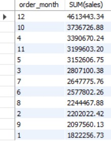
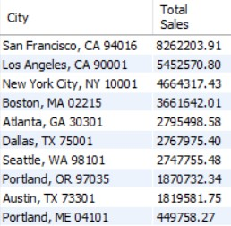
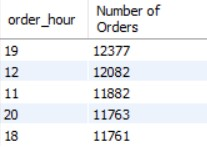
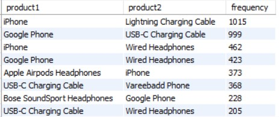
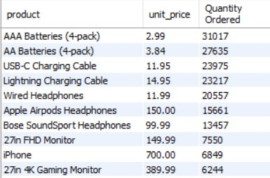

# Electronics Sales Project Using SQL


## 1.0 Introduction
### 1.1 Project objective
The objective of this project is to analyze the electronic sales data of an online store to gain valuable insights into the sales performance and customer behavior. 

The analysis aims to answer key business questions and uncover patterns that can help optimize marketing strategies and enhance overall business operations.

### 1.2 Questions answered in this project
Questions answered in this project are as the following:
- Which month had the highest number of sales, and what is the overall trend?
- Which city had the highest number of sales?
- What is the best time of the day to display product advertisements?
- What 2 combination of the products are often sold together?
- Which product sold the most?


## 2.0 Data Process
### 2.1 Importing data from csv file
The first step in the data analysis process was to import the raw data from a CSV file into a Python environment. This was achieved using the pandas library, a powerful data manipulation tool in Python. By importing the data into a DataFrame, it became easier to manipulate and analyze the data using Python's data processing capabilities.

The following code snippet demonstrates how the data was imported:

```python
import pandas as pd
df = pd.read_csv('./orders.csv')
for index, row in df.iterrows():
    values = ", ".join([f"'{value.replace('/', '-') if str(value) != 'nan'  else 'NULL'}'" for value in row.values])
    print(f"({values}),")
```


### 2.2 Data selection
In this project the following datasets were utilized:

order_id: identifier for each transaction order by customer

product: name of the item sold

quantity: quantity of item sold

unit_price: price of each item

order_date: date and time of order made

purchase_address: customer address

### 2.3 Dataset issues detected
- presence of column names in rows of dataset
- dataset contains empty rows
- order_date appears in non-standard format for MySQL
- some of the column is not in its proper datatype due to imported data comes in VARCHAR type

**SQL to resolve these:**
- deleted rows with column names by targeting row with order_id = 'order_id'
- deleted empty rows by targeting row with order_id = 'NULL'
- added new column to convert order_date column into a proper datetime format and deleted the original column afterwards
- modified the columns to specify the correct datatype

```sql
DELETE FROM orders
WHERE order_id = 'order_id';
```
```sql
DELETE FROM orders
WHERE order_id = 'NULL';
```

```sql
ALTER TABLE orders
ADD COLUMN new_order_date DATETIME AFTER unit_price;
UPDATE orders
SET new_order_date = STR_TO_DATE(order_date, '%m-%d-%y %H:%i');
ALTER TABLE orders
DROP COLUMN order_date;
ALTER TABLE orders
CHANGE COLUMN new_order_date order_date DATETIME;
```

```sql
ALTER TABLE orders
MODIFY COLUMN quantity int;

ALTER TABLE orders
MODIFY COLUMN unit_price DECIMAL(10, 2);
```


## 3.0 Analysis Phase
**Which month had the highest number of sales, and what is the overall trend?**
- In December 2019, $4,613,443.34 worth of sales were made making it the highest number of sales across the year, followed by sales made in October. This indicates strong holiday performance.
- Monthly sales consistently increased from beginning of 2019. However, it started to show gradual decline in May which could be a result of various factors such as seasonal fluctuations, economic conditions, or competitive pressures.
-  There is a general trend of increasing sales from January to December, indicating consistent growth in sales throughout the year.



```sql
-- Adding month column
ALTER TABLE orders
ADD COLUMN order_month VARCHAR(2);
UPDATE orders
SET order_month = MONTH(order_date);

-- Adding sales column
ALTER TABLE orders
ADD COLUMN sales DECIMAL(10, 2) AFTER unit_price;
UPDATE orders
SET sales = quantity * unit_price;

-- Identifying monthly total sales, in decreasing order
SELECT order_month, SUM(sales) FROM orders
GROUP BY order_month
ORDER BY SUM(sales) DESC;
```

**Which city had the highest number of sales?**
- San Francisco, CA leads with total sales of $8,262,203.91, indicating strong sales performance, possibly due to a large customer base or high-demand products, followed by Los Angeles, CA.
- Portland, ME total sales of $449,758.27, indicating a smaller market size compared to other cities. However, this could present opportunities for targeted marketing or expansion strategies to increase sales in this region.



```sql
-- Adding city column
ALTER TABLE orders
ADD COLUMN city VARCHAR(255);
UPDATE orders
SET city = SUBSTRING_INDEX(purchase_address, ', ', -2);
```
```sql
-- Identifying total sales for each city, in decreasing order
SELECT city AS City, SUM(sales) AS "Total Sales" FROM orders
GROUP BY city
ORDER BY SUM(sales) DESC;
```


**What is the best time of the day to display product advertisements?**
- data shows that 7:00 PM had the highest number of orders. This could be attributed to customers placing orders after finishing work or during dinner time. Displaying product advertisements during this hour can potentially reach a large number of customers who are actively shopping.
- 8:00 PM & 6:00 PM also have high order volumes. Customers may be more relaxed in the evening and more likely to browse and make purchases.



```sql
-- Adding hour column
ALTER TABLE orders
ADD COLUMN order_hour VARCHAR(2);
UPDATE orders
SET order_hour = HOUR(order_date);
```
```sql
-- Identifying Most suitable time to display product advertisements
SELECT order_hour, COUNT(DISTINCT order_id) AS "Number of Orders" FROM orders
GROUP BY order_hour
ORDER BY COUNT(DISTINCT order_id) DESC
LIMIT 5;
```


**What combination of 2 products are often sold together?**
- The most frequent pair, which is iPhone and Lightning Charging Cable, indicates that many iPhone users purchase a Lightning Charging Cable as an accessory.
- Similarly, users of Google Phones often purchase a USB-C Charging Cable.
- Based on the frequent pairs, businesses could offer bundle deals or promotions for these combinations to encourage customers to purchase both products together, increasing overall sales.




```sql
-- Identifying products often sold together, in decreasing order
SELECT 
    a.product AS product1, 
    b.product AS product2, 
    COUNT(a.order_id) AS frequency
FROM 
    orders a
JOIN 
    orders b ON a.order_id = b.order_id AND a.product < b.product
GROUP BY 
    a.product, b.product
ORDER BY 
    frequency DESC;
```


**Which product sold the most?**
- AAA Batteries (4-pack) and AA Batteries (4-pack) are the top-selling items, indicating a high demand for portable power sources among customers.
- Businesses could consider offering bundle deals or promotions to encourage customers to purchase complementary products together, potentially increasing overall sales revenue.
- Low-priced products had high order volumes. Customers are more likely to make impulse purchases for such items. 
- Similarly, products with higher unit prices tend to have lower quantities sold. This is expected as customers may be more price-sensitive when purchasing higher-priced items.




```sql
-- Identifying product sold the most
SELECT product, unit_price, SUM(quantity) AS "Quantity Ordered" FROM orders
GROUP BY product, unit_price
ORDER BY SUM(quantity) DESC
LIMIT 10;
```


## 4.0 Insights & Business Opportunities

Sales show a clear seasonal trend, with higher sales in the latter part of the year (October to December) and lower sales in the earlier months (January to March). 

There is a positive trend of increasing sales throughout the year. San Francisco, CA, leads in total sales, followed by Los Angeles, CA, and New York City, NY. West Coast cities like San Francisco and Los Angeles show strong market presence, while East Coast cities like New York City and Boston also contribute significantly to sales.

Peak ordering hours are 19:00 (7:00 PM), 12:00 (12:00 PM), and 11:00 (11:00 AM). Evening hours, especially 19:00 (7:00 PM), are critical for order processing, while lunchtime sees a high volume of orders.

Certain product combinations are frequently sold together, such as "iPhone" and "Lightning Charging Cable," indicating a high likelihood of customers purchasing these items together. This suggests an opportunity for bundling or cross-promotion strategies to increase sales. The top-selling products are "iPhone," "Lightning Charging Cable," and "USB-C Charging Cable," indicating a high demand for these items. Understanding the popularity of these products can help in inventory management and marketing strategies to capitalize on their popularity.


**Recommendations for business decisions:**
1. Capitalize on seasonal trends by offering promotions and discounts during peak sales months like December.
2. Develop region-specific promotions or products based on regional preferences and trends.
3. Based on the best time of the day for product advertisements (e.g., 7:00 PM), schedule advertising campaigns to reach customers when they are most likely to make purchases.
4. Place the top product combinations in strategic locations on your website or in your store to increase visibility and encourage impulse purchases.
5. Focus marketing campaigns on high-selling products such as AAA Batteries (4-pack) and AA Batteries (4-pack) to capitalize on their popularity.
6. Implement loyalty programs or incentives to encourage repeat purchases and customer retention.
